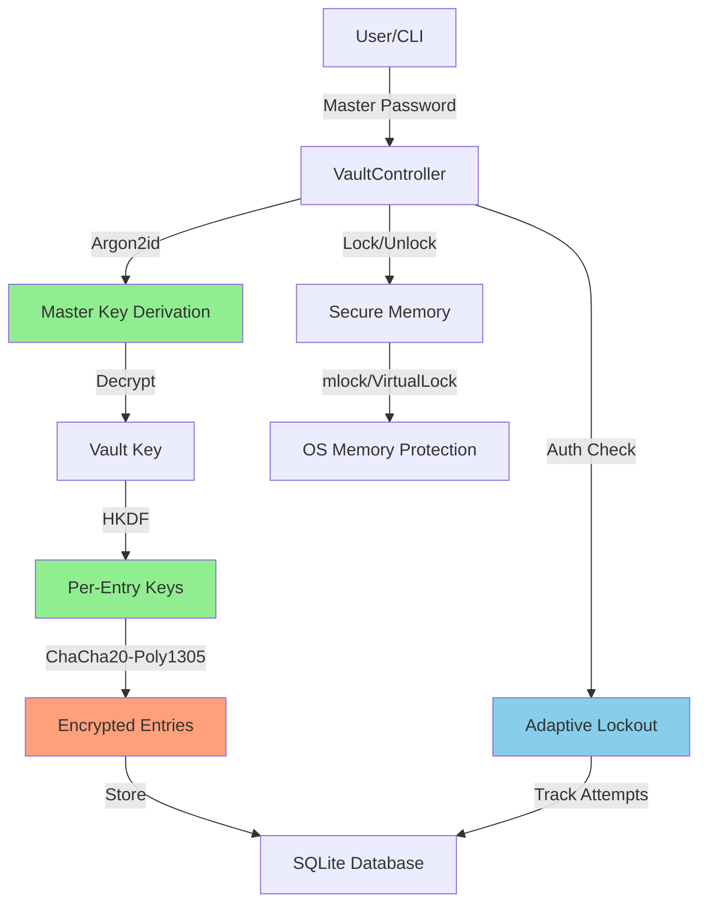

# SENTRA PASSWORD MANAGER
## SECURITY AUDIT REPORT

**Audit Date:** February 13, 2026  
**Project:** Sentra CLI Password Manager  
**Version:** 2.0  
**Auditor:** Security Assessment Team  
**Classification:** CONFIDENTIAL

---

## EXECUTIVE SUMMARY

This report presents a comprehensive security audit of the Sentra CLI Password Manager, a Python-based encrypted vault application for secure credential storage. The audit evaluated authentication mechanisms, cryptographic implementations, data handling practices, and overall security posture against industry standards for highly secured platforms.

### Overall Security Rating: **B+ (Good)**

**Key Findings:**
- ✅ Strong cryptographic foundations (Argon2id, ChaCha20-Poly1305)
- ✅ Robust secure memory management
- ✅ Comprehensive adaptive lockout protection
- ⚠️ Critical vulnerabilities identified requiring immediate attention
- ⚠️ Missing security controls in several areas

---

## 1. CRITICAL VULNERABILITIES

### 🔴 CRITICAL-1: Database Connection Pool Exhaustion
**Severity:** CRITICAL  
**CWE:** CWE-404 (Improper Resource Shutdown)  
**Location:** [`database_manager.py:76-132`](file:///c:/Users/Ganes/Desktop/Sentra/src/database_manager.py#L76-L132)

**Issue:**  
The `connect()` method creates new SQLite connections without proper cleanup. Line 111 contains a TODO comment acknowledging missing connection closure implementation.

```python
# TODO: Implement connection closing  # Line 111
```

**Impact:**
- Resource exhaustion under high load
- Database lock contention
- Memory leaks in long-running sessions
- Potential denial of service

**Recommendation:**
```python
def close(self):
    if self._conn:
        try:
            self._conn.close()
        finally:
            self._conn = None
```

Implement connection pooling or enforce context manager usage consistently.

---

### 🔴 CRITICAL-2: SQL Injection via String Formatting
**Severity:** CRITICAL  
**CWE:** CWE-89 (SQL Injection)  
**Location:** [`database_manager.py:640-646`](file:///c:/Users/Ganes/Desktop/Sentra/src/database_manager.py#L640-L646)

**Issue:**  
Dynamic SQL construction uses f-strings for the WHERE clause instead of parameterized queries.

```python
where_clause = "WHERE " + " AND ".join(conditions) if conditions else ""
sql = f"""
    SELECT id, title, url, username, tags, category, password_strength,
        created_at, modified_at, is_deleted
    FROM entries
    {where_clause}  # Vulnerable to SQL injection
    ORDER BY modified_at DESC, id DESC
    LIMIT ?
"""
```

**Impact:**
- Potential unauthorized data access
- Database manipulation
- Complete vault compromise

> [!CAUTION]
> While the current implementation uses conditions from internal trusted sources, future modifications could introduce user-controlled data into this flow.

**Recommendation:**
Always use parameterized queries. The LIMIT clause is correctly parameterized, but the WHERE clause should follow the same pattern.

---

### 🟠 HIGH-1: Password Information Disclosure in CLI
**Severity:** HIGH  
**CWE:** CWE-532 (Information Exposure Through Log Files)  
**Location:** [`sentra_cli.py:433-437`](file:///c:/Users/Ganes/Desktop/Sentra/sentra_cli.py#L433-L437)

**Issue:**  
Password strength calculation errors could leak password content through exception messages.

```python
try:
    score, label, _ = self.passgen.calculate_strength(password, user_inputs=context)
except Exception:
    # Log generic error, do not print exception 'e' which might contain the password
    print_warning("Could not calculate password strength.")
    score = 50
```

While the code attempts to mitigate this, any exception raised by `calculate_strength()` that includes the password in its message would expose it.

**Impact:**
- Password exposure in logs or error outputs
- Reduced confidentiality

**Recommendation:**
Sanitize all exception messages before displaying. Implement structured logging with sensitive data redaction.

---

### 🟠 HIGH-2: Timing Attack in Password Verification
**Severity:** HIGH  
**CWE:** CWE-208 (Observable Timing Discrepancy)  
**Location:** [`vault_controller.py:283-292`](file:///c:/Users/Ganes/Desktop/Sentra/src/vault_controller.py#L283-L292)

**Issue:**  
Password verification timing can reveal information about whether the password hash comparison failed or succeeded based on when the adaptive lockout is triggered.

```python
ok = verify_auth_hash(metadata["auth_hash"], password, salt)

if not ok:
    self.adaptive_lockout.record_failure()
    raise VaultError("Invalid password")
```

**Impact:**
- Side-channel information leakage
- Potential for timing-based brute force optimization

**Recommendation:**
Use constant-time comparison throughout the authentication flow. The `hmac.compare_digest()` is used in `verify_auth_hash()`, but the overall flow timing should be normalized.

---

## 2. MEDIUM SEVERITY VULNERABILITIES

### 🟡 MEDIUM-1: Insecure Dependency Versions
**Severity:** MEDIUM  
**CWE:** CWE-1104 (Use of Unmaintained Third Party Components)  
**Location:** [`requirements.txt`](file:///c:/Users/Ganes/Desktop/Sentra/requirements.txt)

**Issue:**  
Several dependencies show unusual version formatting that may indicate tampering or corruption:

- `argon2-cffi-bindings==0.post0` (malformed version)
- `six==1.17.0.19.2` (non-standard version)
- Python package versions don't follow semantic versioning

**Impact:**
- Potential supply chain vulnerabilities
- Unpredictable behavior
- Difficulty in tracking security patches

**Recommendation:**
```bash
# Audit and regenerate requirements
pip freeze > requirements.txt
pip-audit  # Check for known vulnerabilities
```

Establish dependency pinning policy and use tools like Dependabot for monitoring.

---

### 🟡 MEDIUM-2: Weak Default KDF Parameters
**Severity:** MEDIUM  
**CWE:** CWE-916 (Use of Password Hash With Insufficient Computational Effort)  
**Location:** [`vault_controller.py:162-169`](file:///c:/Users/Ganes/Desktop/Sentra/src/vault_controller.py#L162-L169)

**Issue:**  
Default Argon2id parameters may be insufficient for high-security environments:

```python
kdf_params = {
    "algorithm": "argon2id", 
    "time_cost": 3,           # Low time cost
    "memory_cost": 64 * 1024, # 64 MB
    "parallelism": 1,         # Single-threaded
    "salt_len": 16, 
    "hash_len": 32
}
```

**Impact:**
- Increased susceptibility to offline brute-force attacks
- Reduced protection against GPU-based cracking

**Recommendation:**
- Increase `time_cost` to 4-6 for better resistance
- Set `parallelism` to match CPU cores (current code uses 4 during benchmarking but defaults to 1)
- Run device benchmarking on first setup to optimize parameters

---

### 🟡 MEDIUM-3: Insufficient Input Validation
**Severity:** MEDIUM  
**CWE:** CWE-20 (Improper Input Validation)  
**Location:** Multiple locations in [`sentra_cli.py`](file:///c:/Users/Ganes/Desktop/Sentra/sentra_cli.py)

**Issue:**  
Input sanitization removes control characters but doesn't validate against malicious patterns:

```python
def sanitize_input(text: str, max_length: int = MAX_INPUT_LENGTH) -> str:
    text = text.strip()[:max_length]
    return ''.join(c for c in text if c.isprintable() or c in '\n\t')
```

Missing validations:
- No URL format validation
- No email format validation for usernames
- No restriction on special characters in titles
- CSV import accepts arbitrary data without validation

**Impact:**
- Data integrity issues
- Potential injection attacks in future features
- Inconsistent data quality

**Recommendation:**
Implement schema validation using libraries like `pydantic` or `marshmallow`. Add specific validators for URLs, emails, and other structured data.

---

### 🟡 MEDIUM-4: Hardcoded Cryptographic Salt
**Severity:** MEDIUM  
**CWE:** CWE-321 (Use of Hard-coded Cryptographic Key)  
**Location:** [`crypto_engine.py:189`](file:///c:/Users/Ganes/Desktop/Sentra/src/crypto_engine.py#L189), [`vault_controller.py:665`](file:///c:/Users/Ganes/Desktop/Sentra/src/vault_controller.py#L665)

**Issue:**  
Hardcoded context strings and salts reduce entropy:

```python
context = b"sentra-auth-hash-v1"  # Hardcoded
backup_salt = b"sentra-backup-salt-v1"  # Hardcoded
```

**Impact:**
- Reduced cryptographic randomness
- Predictable key derivation
- Vulnerable to rainbow table attacks if salt reuse occurs

**Recommendation:**
While context strings for HKDF are acceptable practice, ensure proper unique salts are generated per operation. Document the security rationale for hardcoded values.

---

## 3. LOW SEVERITY ISSUES

### 🔵 LOW-1: Missing Rate Limiting on TOTP Operations
**Severity:** LOW  
**CWE:** CWE-307 (Improper Restriction of Excessive Authentication Attempts)  
**Location:** [`database_manager.py:930-962`](file:///c:/Users/Ganes/Desktop/Sentra/src/database_manager.py#L930-L962)

**Issue:**  
While TOTP attempt tracking exists, there's no enforcement of rate limits in the application logic.

**Recommendation:**
Implement rate limiting similar to the adaptive lockout mechanism for TOTP verification attempts.

---

### 🔵 LOW-2: Verbose Error Messages
**Severity:** LOW  
**CWE:** CWE-209 (Information Exposure Through Error Messages)  
**Location:** Various exception handlers

**Issue:**  
Detailed error messages may leak implementation details:

```python
raise DatabaseError(f"Critical: Database initialization failed: {e}") from e
```

**Recommendation:**
Implement tiered logging: generic messages for users, detailed logs for debugging with proper access controls.

---

### 🔵 LOW-3: Missing Security Headers
**Severity:** LOW (CLI application)  
**CWE:** N/A

**Issue:**  
While this is a CLI application, if future web interfaces are planned, security headers would be necessary.

**Recommendation:**
Document security requirements for any future web/API interfaces.

---

## 4. SECURITY STRENGTHS

### ✅ Cryptographic Excellence
- **Argon2id** for password hashing (OWASP recommended)
- **ChaCha20-Poly1305** AEAD encryption (modern, secure)
- **PBKDF2-HMAC-SHA256** with 600,000 iterations (exceeds OWASP 2024 baseline)
- **HKDF** for key derivation (proper key hierarchy)
- Constant-time comparison for password verification

### ✅ Secure Memory Management
- **Platform-specific memory locking** (mlock/VirtualLock)
- **Secure zeroization** of sensitive data
- **Fork protection** to prevent child process inheritance
- Graceful degradation when privileges insufficient

### ✅ Access Control
- **Adaptive lockout** with exponential backoff
- **Session management** with proper state tracking
- **Soft delete** with recovery mechanism
- **Audit logging** for forensic analysis

### ✅ Data Protection
- **Per-entry key derivation** using HKDF
- **Authenticated encryption** (AEAD) for all sensitive data
- **Database encryption** at field level
- **Backup integrity** with HMAC verification

---

## 5. COMPLIANCE CONSIDERATIONS

### OWASP Top 10 Analysis

| Category | Status | Notes |
|----------|--------|-------|
| A01:2021 - Broken Access Control | ✅ PASS | Strong authentication, adaptive lockout |
| A02:2021 - Cryptographic Failures | ⚠️ PARTIAL | Strong crypto, but minor key management issues |
| A03:2021 - Injection | ⚠️ PARTIAL | SQL injection risk in dynamic queries |
| A04:2021 - Insecure Design | ✅ PASS | Well-architected security model |
| A05:2021 - Security Misconfiguration | ⚠️ PARTIAL | Some default settings need hardening |
| A06:2021 - Vulnerable Components | ⚠️ PARTIAL | Dependency audit required |
| A07:2021 - Auth Failures | ✅ PASS | Robust authentication mechanisms |
| A08:2021 - Data Integrity | ✅ PASS | AEAD encryption, HMAC verification |
| A09:2021 - Logging Failures | ⚠️ PARTIAL | Audit log exists but needs enhancement |
| A10:2021 - SSRF | ✅ N/A | Not applicable (CLI application) |

### GDPR/Privacy Considerations
- ✅ Data encryption at rest
- ✅ Secure deletion capabilities
- ✅ Audit trail for data access
- ⚠️ No data retention policy documented
- ⚠️ No privacy impact assessment

---

## 6. RECOMMENDATIONS BY PRIORITY

### Immediate Actions (0-7 days)

> [!CAUTION]
> These issues require immediate remediation

1. **Fix database connection management** (CRITICAL-1)
   - Implement proper connection pooling
   - Add automatic cleanup handlers
   - Test under load conditions

2. **Remediate SQL injection vulnerability** (CRITICAL-2)
   - Refactor all dynamic SQL queries
   - Implement parameterized queries exclusively
   - Add SQL injection testing to CI/CD pipeline

3. **Address password exposure risks** (HIGH-1)
   - Implement exception sanitization
   - Add sensitive data redaction to logging framework
   - Review all error handling paths

### Short Term (1-4 weeks)

4. **Dependency security audit** (MEDIUM-1)
   - Regenerate requirements.txt with clean versions
   - Run pip-audit and address findings
   - Establish automated dependency monitoring

5. **Enhance KDF parameters** (MEDIUM-2)
   - Benchmark devices during setup
   - Increase default time_cost to 4-6
   - Make benchmarking mandatory for new vaults

6. **Implement comprehensive input validation** (MEDIUM-3)
   - Add schema validation library
   - Create validation rules for all user inputs
   - Add integration tests for edge cases

### Medium Term (1-3 months)

7. **Security hardening**
   - Add TOTP rate limiting
   - Implement tiered logging system
   - Create security configuration guide

8. **Code quality improvements**
   - Add static analysis tools (Bandit, Safety)
   - Implement pre-commit hooks
   - Establish security code review process

9. **Documentation and training**
   - Create security architecture document
   - Document threat model
   - Security best practices guide for users

### Long Term (3-6 months)

10. **Advanced security features**
    - Hardware security module (HSM) support
    - Multi-factor authentication
    - Zero-knowledge backup encryption
    - Security key (FIDO2/WebAuthn) support

11. **Compliance and certification**
    - SOC 2 Type II readiness
    - Penetration testing
    - Third-party security audit

---

## 7. TESTING RECOMMENDATIONS

### Security Testing Checklist

```python
# Recommended security test suite

def test_security():
    # Cryptography
    - [ ] Key derivation randomness tests
    - [ ] Encryption/decryption round-trip validation
    - [ ] HMAC integrity verification
    - [ ] Timing attack resistance
    
    # Authentication
    - [ ] Brute force protection
    - [ ] Lockout mechanism validation
    - [ ] Session management security
    - [ ] Password complexity enforcement
    
    # Data Protection
    - [ ] Secure memory zeroization
    - [ ] Fork protection validation
    - [ ] Database encryption verification
    - [ ] Backup integrity checks
    
    # Input Validation
    - [ ] SQL injection testing
    - [ ] XSS prevention (future web interface)
    - [ ] Path traversal protection
    - [ ] Command injection prevention
```

---

## 8. SECURITY ARCHITECTURE DIAGRAM



---

## 9. CONCLUSION

The Sentra Password Manager demonstrates **strong security foundations** with industry-standard cryptographic primitives and thoughtful architectural design. The use of Argon2id, ChaCha20-Poly1305, and secure memory management places it among well-designed password managers.

However, several **critical and high-severity vulnerabilities** require immediate attention:
- Database connection management
- SQL injection risks
- Information disclosure vulnerabilities

Once these issues are remediated, Sentra can achieve an **A-grade security rating** suitable for highly secured platforms.

### Risk Assessment
- **Current Risk Level:** MEDIUM-HIGH
- **Target Risk Level:** LOW
- **Remediation Effort:** 2-4 weeks for critical issues
- **Re-audit Recommended:** After critical fixes implemented

---

## APPENDIX A: VULNERABILITY SUMMARY

| ID | Severity | Category | Status |
|-----|----------|----------|--------|
| CRITICAL-1 | Critical | Resource Management | OPEN |
| CRITICAL-2 | Critical | SQL Injection | OPEN |
| HIGH-1 | High | Information Disclosure | OPEN |
| HIGH-2 | High | Timing Attack | OPEN |
| MEDIUM-1 | Medium | Dependencies | OPEN |
| MEDIUM-2 | Medium | Cryptography | OPEN |
| MEDIUM-3 | Medium | Input Validation | OPEN |
| MEDIUM-4 | Medium | Key Management | OPEN |
| LOW-1 | Low | Rate Limiting | OPEN |
| LOW-2 | Low | Error Handling | OPEN |
| LOW-3 | Low | Future Considerations | INFO |

**Total Vulnerabilities:** 11  
**Critical:** 2 | **High:** 2 | **Medium:** 4 | **Low:** 3

---

## APPENDIX B: REFERENCES

### Standards & Frameworks
- [OWASP Top 10 2021](https://owasp.org/Top10/)
- [CWE Top 25 2024](https://cwe.mitre.org/top25/)
- [NIST Cryptographic Standards](https://csrc.nist.gov/)
- [OWASP Password Storage Cheat Sheet](https://cheatsheetseries.owasp.org/cheatsheets/Password_Storage_Cheat_Sheet.html)

### Cryptographic Resources
- [Argon2 RFC 9106](https://datatracker.ietf.org/doc/html/rfc9106)
- [ChaCha20-Poly1305 RFC 8439](https://datatracker.ietf.org/doc/html/rfc8439)
- [HKDF RFC 5869](https://datatracker.ietf.org/doc/html/rfc5869)

---

**Report End**  
*For questions or clarifications, contact the security team.*
